# AI Cloud Cost Intelligence Engine

An AI-powered cloud cost intelligence platform that transforms cloud usage events into actionable cost optimization insights using an event-driven microservices architecture.

The platform combines FastAPI microservices, GraphQL, LangGraph, OpenRouter, AWS cloud services, Docker, and GitHub Actions to simulate a modern cloud-native FinOps solution with automated deployment, monitoring, and benchmarking.

---

## Table of Contents

- Project Overview
- Project Highlights
- Problem Statement
- Key Features
- System Architecture
- Technology Stack
- Project Workflow
- Event-Driven Architecture
- AI Reasoning Pipeline
- CI/CD Pipeline
- Deployment & Monitoring
- Screenshots
- Project Structure
- Running the Project
- Future Enhancements
- Author

---

# Project Overview

Cloud platforms generate a massive amount of usage and billing data every day. Raw billing information alone provides very little business value unless it is processed, analyzed, and converted into meaningful recommendations.

The AI Cloud Cost Intelligence Engine demonstrates how an event-driven cloud-native system can automate this process.

Instead of processing requests synchronously, services communicate using asynchronous events, allowing the platform to scale while remaining loosely coupled.

The project combines modern backend engineering practices with AI-powered reasoning to generate cloud cost optimization recommendations.

---

# 🚀 Project Highlights

The AI Cloud Cost Intelligence Engine combines event-driven microservices, AI-powered reasoning, cloud-native deployment, and automated DevOps practices into a scalable cloud cost intelligence platform.

| Category | Achievement |
|----------|-------------|
| 🏗️ Architecture | Event-Driven Microservices Architecture with GraphQL API Gateway |
| ⚙️ Backend Services | Independent Ingestion, Analytics, Intelligence, Storage and GraphQL Gateway microservices |
| 🤖 AI Pipeline | LangGraph orchestration with OpenRouter LLM for intelligent cloud cost recommendations |
| ☁️ Cloud Platform | Deployed on AWS using EC2, S3, CloudFront, API Gateway, Lambda and Amazon SQS |
| 🚀 CI/CD | Fully automated CI/CD pipeline using GitHub Actions and Docker |
| 📊 Deployment Benchmarking | Automatically generates deployment history, statistics and benchmark summary after every successful deployment |
| 📧 Deployment Reporting | Automated HTML deployment reports delivered through Amazon SES after every successful deployment |
| ⚡ Query Optimization | Reduced GraphQL query execution time from **256 ms** to approximately **50 ms** using database indexing (**~80% improvement**) |
| ⏱️ Deployment Optimization | Reduced average deployment duration from **255 seconds** to approximately **133 seconds** (**~48% improvement**) |
| ❤️ Health Verification | Automated deployment validation with **100% successful health checks** |
| 🐳 Container Orchestration | Automatically deploys and verifies **4 Dockerized backend services** |
| 📈 Observability | Custom benchmark engine continuously records deployment metrics for performance analysis and historical comparison |
| 🔄 Event Processing | Loosely coupled asynchronous communication through Amazon SQS enabling scalable event-driven processing |

---

# Problem Statement

Organizations often know **how much** they spend in the cloud but struggle to understand **why** costs increase and **how** to optimize them.

This project demonstrates how AI and distributed systems can work together to:

- Collect cloud cost events
- Process usage asynchronously
- Generate intelligent recommendations
- Store processed insights
- Expose insights through GraphQL
- Automate deployment and monitoring

---

# Key Features

- Event-Driven Microservices Architecture
- GraphQL API Gateway
- AI-Powered Cloud Cost Recommendations
- LangGraph Multi-Step AI Workflow
- OpenRouter LLM Integration
- AWS Lambda Based AI Processing
- Amazon SQS Message Queue
- Dockerized Microservices
- GitHub Actions CI/CD Pipeline
- Automated Deployment Validation
- Deployment Benchmark Engine
- AWS Cloud Deployment
- GraphQL API
- Cloud Cost Analytics Dashboard

---

# System Architecture

## Overall AWS Architecture

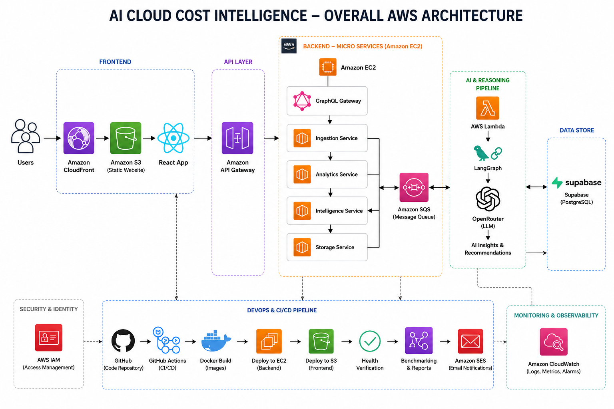

---

## Backend Architecture

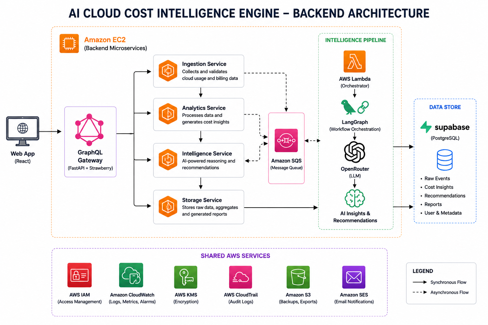

---

## AI Reasoning Pipeline

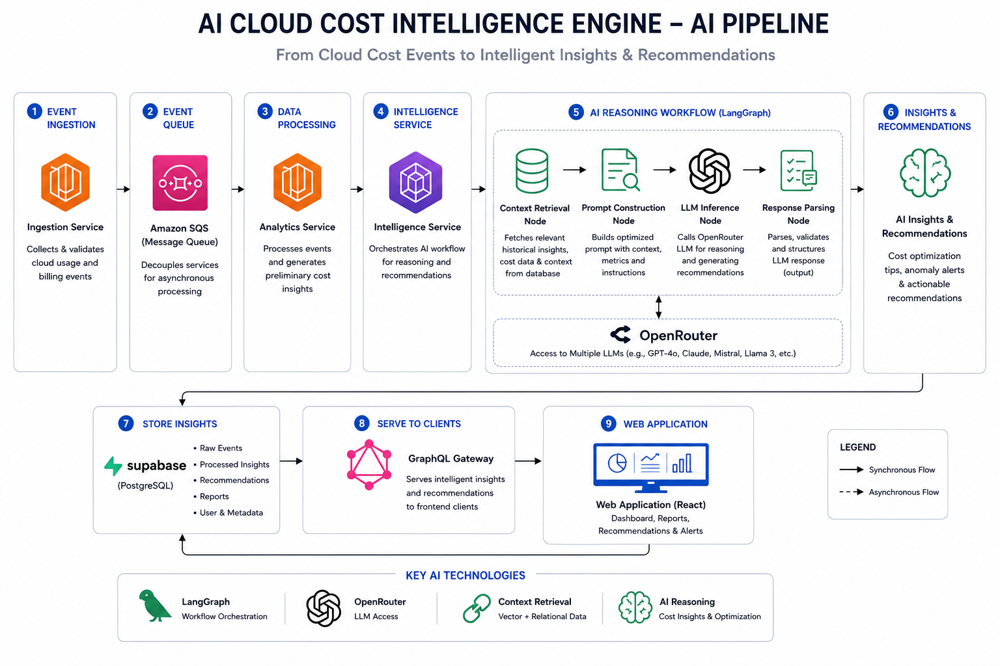

---

## CI/CD Pipeline

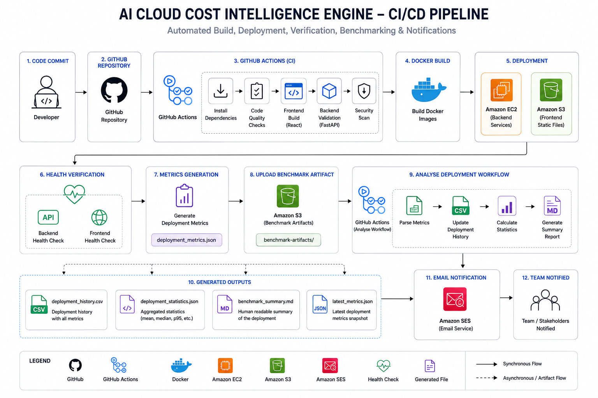

---

## Deployment Monitoring & Benchmarking

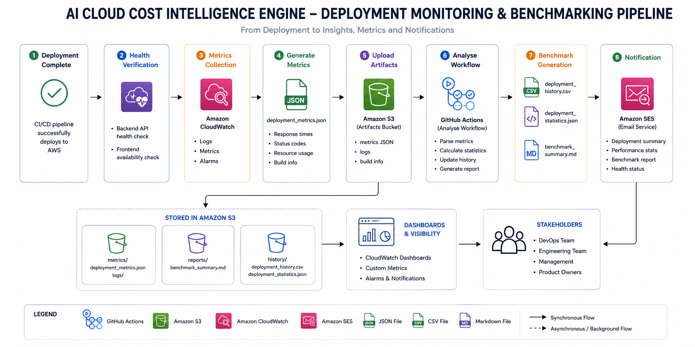

---

# Technology Stack

| Layer | Technologies |
|--------|--------------|
| Frontend | React, JavaScript |
| Backend | FastAPI |
| API Gateway | GraphQL (Strawberry GraphQL) |
| Database | PostgreSQL (Supabase) |
| Event Messaging | Amazon SQS |
| AI Framework | LangGraph, LangChain |
| LLM | OpenRouter |
| Cloud | AWS EC2, S3, CloudFront, Lambda |
| DevOps | Docker, GitHub Actions |
| Monitoring | CloudWatch |
| Email | Amazon SES |

---

# Project Workflow

The platform processes cloud cost events through multiple distributed services.

1. A cloud cost event is received by the Ingestion Service.
2. The event is published to Amazon SQS.
3. Analytics Service consumes the event.
4. Intelligence Service retrieves contextual information.
5. LangGraph orchestrates the AI reasoning workflow.
6. OpenRouter generates optimization recommendations.
7. Storage Service persists processed insights.
8. GraphQL Gateway exposes the data.
9. The React dashboard displays insights to users.

---

# Event-Driven Architecture

The system follows an asynchronous event-driven architecture.

Instead of tightly coupling services together, events are exchanged through Amazon SQS.

Benefits include:

- Loose coupling
- Independent service scaling
- Improved fault tolerance
- Better reliability
- Easier future service expansion

Current services:

- GraphQL Gateway
- Ingestion Service
- Analytics Service
- Intelligence Service
- Storage Service

---

# AI Reasoning Pipeline

The Intelligence Service performs AI-assisted cloud cost analysis using LangGraph.

The workflow consists of:

- Context Retrieval
- Prompt Construction
- LangGraph Execution
- OpenRouter LLM Reasoning
- Recommendation Generation
- Insight Storage

This separation allows the AI workflow to remain modular and extensible for future reasoning strategies.

---

# CI/CD Pipeline

Deployment is fully automated using GitHub Actions.

The pipeline performs:

- Source checkout
- Dependency installation
- Docker image build
- Backend deployment to EC2
- Frontend deployment to Amazon S3
- CloudFront delivery
- Health verification
- Deployment report generation
- Deployment benchmark generation
- Email notification through Amazon SES

---

# Deployment & Monitoring

The project includes a lightweight deployment benchmark engine that records deployment metadata after every successful release.

Recorded metrics include:

- Deployment Duration
- Backend Build Duration
- Frontend Build Size
- Running Containers
- Health Check Success Rate

Deployment history is automatically stored for future analysis.

---

# Screenshots

## Dashboard Overview

### Metrics Dashboard

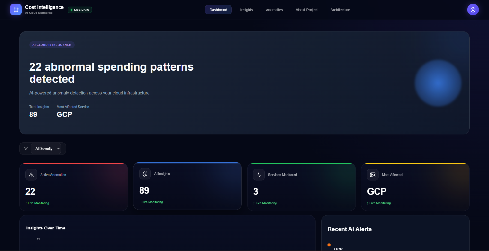

---

### Analytics Dashboard

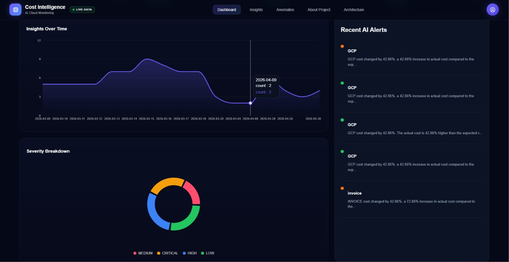

---

### Cost Insights

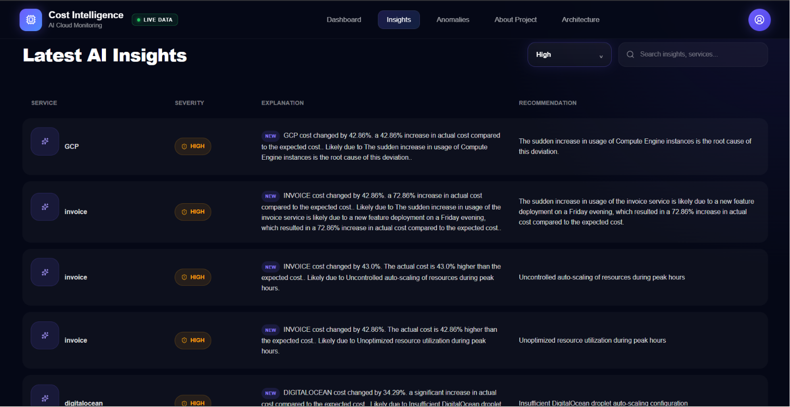

---

### Anomaly Detection

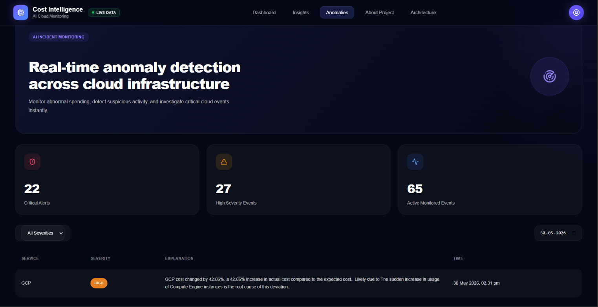

---

### GraphQL Playground

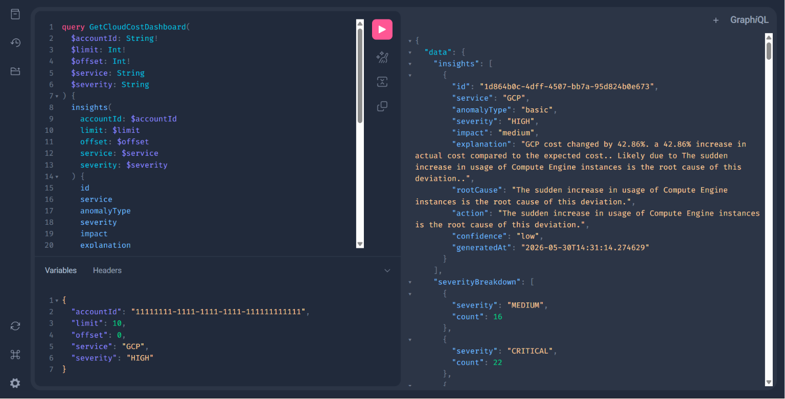

---

## AWS Deployment

### EC2 Instance

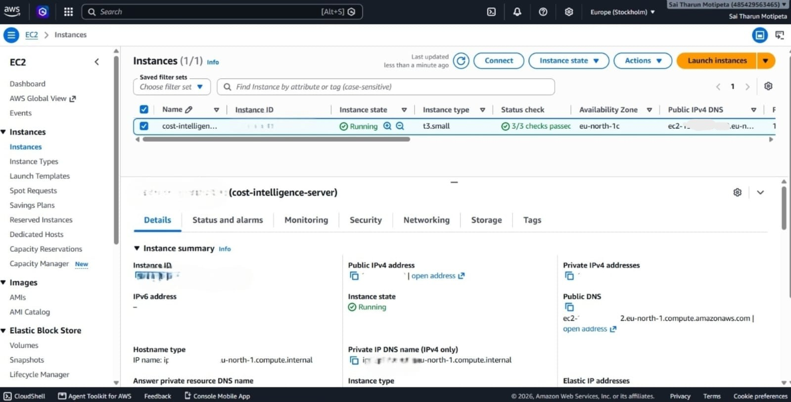

### Amazon S3

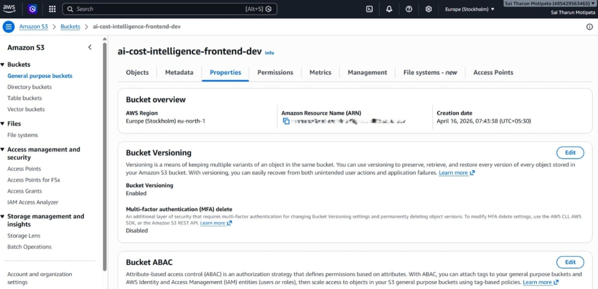

### CloudFront

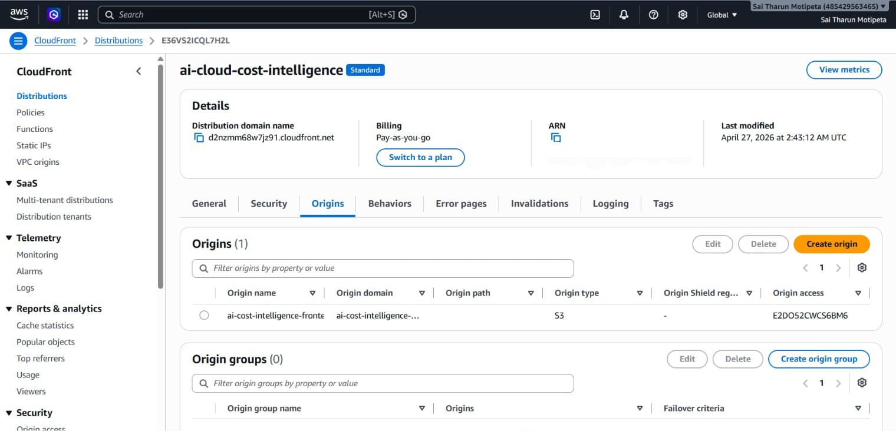

### API Gateway

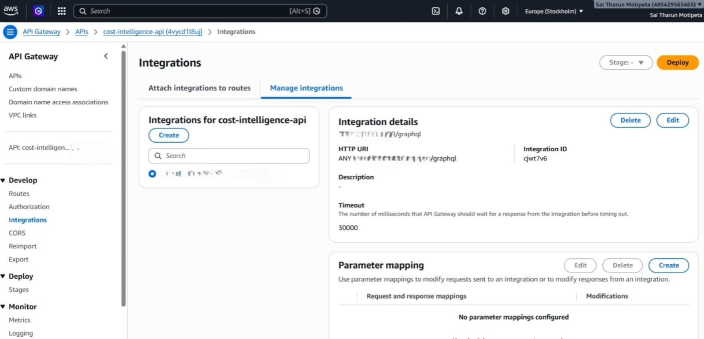

### Amazon SQS

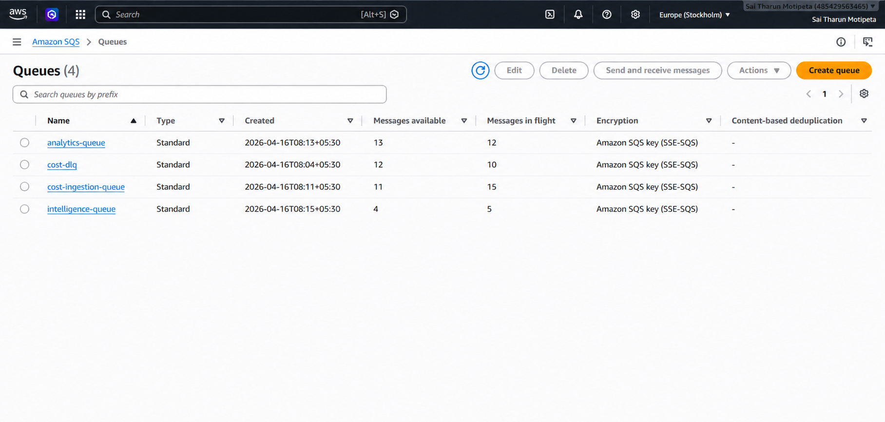

### AWS Lambda

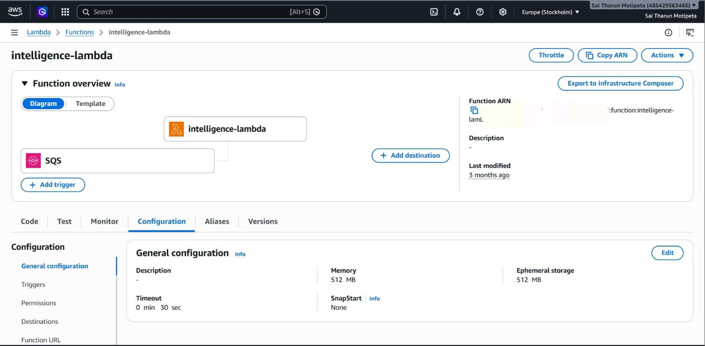

---

# Project Structure

```text
frontend/
backend/
shared/
infrastructure/
benchmarks/
assets/
.github/
```

---

# Running the Project

```bash
git clone <repository-url>

cd ai-cloud-cost-intelligence

docker-compose up --build
```

Frontend

```
http://localhost:3000
```

GraphQL

```
http://localhost:8000/graphql
```

---

# Future Enhancements

- Kubernetes Deployment
- Multi-Cloud Support
- Cost Forecasting
- FinOps Dashboard
- Real-Time Alerts
- Authentication & RBAC
- Multi-Tenant Support
- Distributed Tracing
- OpenTelemetry Integration

---

# Author

**Sai Tharun**

B.Tech Information Technology

Website Link: https://d2nzmm68w7jz91.cloudfront.net
GitHub: https://github.com/Saitharunmotipeta

---

## License

This project is developed as an Proof of concepts and portfolio purposes.
